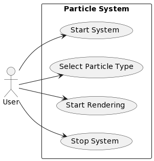
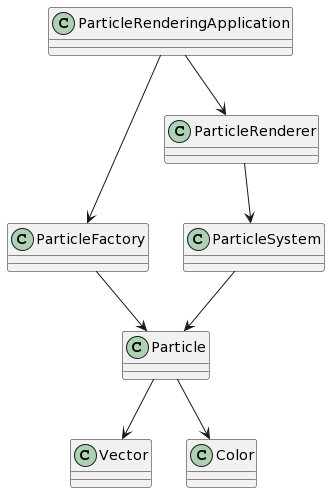
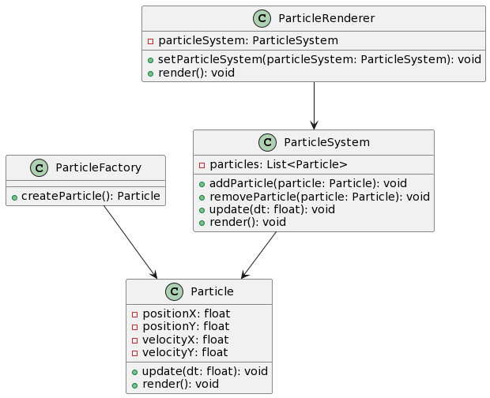

# Project description

## Use case diagram



## Idea

Particle rendering application based on the factory design pattern.

## Use Cases

| **Use Case 1**                  |                             |
|---------------------------------|-----------------------------|
| **Vorbedingung**                | Applikation ist gestartet   |
| **Beschreibung Anwendungsfall** | User möchte einen Partikel Rendern |
| **Nachbedingung**               | -                           |
| **Ausnahmen**                   | -                           |

## General Planning

The Idea is to have a factory which allows us to instantiate different sub-classes of the class Particle. 

The Application would have:
- a class Particle which defines the particle itself.
- a particle factory that instantiates the particles
- a particle system that creates a collection of particles out of the instantiated particles
- a particle renderer that renders the particles in a window

```
g++ -std=c++11 main.cpp Particle.cpp ParticleSystem.cpp ParticleFactory.cpp ParticleRenderer.cpp -o particle_project -I /opt/homebrew/include -L /opt/homebrew/lib -lsfml-graphics -lsfml-window -lsfml-system
```

## Domain Model



## CRC Cards

___________________

**Class: Particle** Responsibilities:

- Define the properties and behavior of a particle.

Collaborators:

- ParticleFactory: Instantiates particles.

________________

**Class: ParticleFactory** Responsibilities:

- Instantiate different sub-classes of the Particle class.
- Provide a method to create particles.

Collaborators:

- Particle: Represents the particle class to be instantiated.

_________________

**Class: ParticleSystem** Responsibilities:

- Create a collection of particles.
- Manage the collection of instantiated particles.

Collaborators:

- ParticleFactory: Instantiate particles for the system.

________________

**Class: ParticleRenderer** Responsibilities:

- Render particles in a window.
- Display the visual representation of particles.

Collaborators:

- ParticleSystem: Provides the collection of particles to be rendered.

_____________

## Use Case Specification

#### **Use Case 1: Start System**

**Preconditions:** The application is not currently running.

**Postconditions:** The application is started and ready for use.

**Description:**

1. The user initiates the application.
2. The system initializes and displays the main application window.
3. The user can proceed to select the particle type and start rendering.

#### **Use Case 2: Select Particle Type**

**Preconditions:** The system is started and the main application window is displayed.

**Postconditions:** The selected particle type is set for rendering.

**Description:**

1. The user interacts with the application to select a specific particle type.
2. The system validates the selected particle type.
3. The system sets the selected particle type for rendering.

#### **Use Case 3: Start Rendering**

**Preconditions:** The system is started, and a particle type is selected.

**Postconditions:** The particles are rendered in a window.

**Description:**

1. The user triggers the start rendering action.
2. The system creates a particle system based on the selected particle type.
3. The system instantiates particles using the particle factory.
4. The particle system manages the collection of particles.
5. The particle renderer renders the particles in a window.

#### **Use Case 4: Stop System**

**Preconditions:** The system is running and particles are being rendered.

**Postconditions:** The system stops rendering particles and returns to the initial state.

**Description:**

1. The user triggers the stop system action.
2. The system stops rendering particles.
3. The system clears the particle collection and returns to the initial state.

These use case specifications outline the sequence of events, preconditions, postconditions, and main actions for each use case represented in the use case diagram.

# Class Diagram
                       
